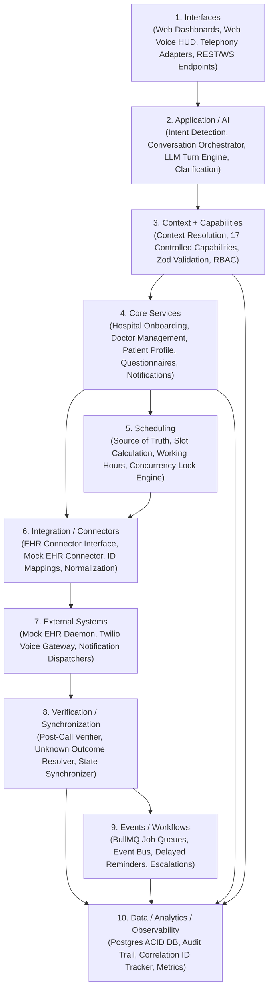

# Architecture Specification: Autonomous Multi-Hospital Patient Intake & Scheduling Platform

> **Document Version:** 1.0.0  
> **Status:** Approved Draft for Prototype Implementation  
> **Target Timeline:** 3–4 Day Prototype  
> **Author:** Antigravity Architect  
> **Source Document:** [Product Requirements Document (PRD v2.0)](file:///docs/PRD.pdf)

---

## 1. Recommended Technology Stack

Each choice is selected strictly for prototype velocity, bulletproof transactional reliability, and transparent demonstration of AI coordination, external healthcare integration, and automated verification/recovery patterns—avoiding unneeded framework novelty.

### Backend Framework: Node.js (v20+ LTS) with Fastify & TypeScript
Fastify with TypeScript delivers industry-leading HTTP/WebSocket throughput, near-instant cold starts, and schema-driven request validation via JSON Schema / TypeBox / Zod. In an event-driven and streaming healthcare platform, Fastify allows direct sharing of compile-time and runtime types with the frontend and capability layer across our monorepo, while providing native encapsulation plugins for strict multi-tenant isolation, correlation-ID tracing, and unified error handling without the boilerplate overhead of heavier enterprise frameworks.

### Database: PostgreSQL 16 with Prisma ORM
PostgreSQL is the gold standard for relational healthcare data requiring uncompromising ACID compliance, relational integrity, and cross-table foreign key constraints to enforce strict tenant isolation (`tenant_id` scoping). Most importantly, PostgreSQL provides row-level locking primitives (`SELECT ... FOR UPDATE`), which are essential to prevent concurrent double-booking of doctor slots during high-traffic intake windows. Prisma ORM guarantees end-to-end type safety, automated migration management, and native JSONB column querying for dynamic questionnaire definitions and conversation context snapshots.

> [!NOTE]
> **Local / Prototype vs. Production Configuration:**  
> - **Local Development & Testing:** The active local environment is configured with **zero-config SQLite** (`file:./dev.db`) to enable completely friction-free local development and fast test execution without requiring external database server daemons.  
> - **Production Target (Phase D):** The target production deployment architecture is **PostgreSQL 16**.  
> - **Verification Clarification:** Postgres row-level locking primitives (`SELECT ... FOR UPDATE`) have been designed and coded for in the scheduling and transaction layers, but have **not been independently verified against a live Postgres instance in this local environment**, because Docker and PostgreSQL are not installed or available on this host. Local concurrency validation runs against SQLite transactions (`prisma.$transaction`).

### Authentication & Authorization: JWT Session Auth with Tenant-Scoped RBAC
To eliminate the external network dependencies, setup friction, and OAuth redirect latency inherent in third-party identity providers during a 3-day prototype, we implement a robust, self-contained JWT authentication service using industry-standard cryptography (`jose` / `bcrypt`). Every issued token embeds cryptographically verified claims: `userId`, `role` (`PLATFORM_ADMIN`, `HOSPITAL_ADMIN`, `DOCTOR`, `PATIENT`), and `tenantId` (for hospital-scoped users). Fastify pre-handler hooks enforce role-based access control and automatically scope all downstream database queries to the requesting tenant, preventing cross-tenant data leaks.

### Real-Time Voice Stack: Web Audio API (Client) + WebSockets + Google Gemini Live API
To achieve the PRD's requirement of sub-2-second perceived latency, bi-directional streaming, turn-taking, and immediate user interruption (barge-in), the frontend captures raw PCM 16kHz audio via the browser's Web Audio API (`AudioWorklet`) and streams chunks over a persistent WebSocket to the backend voice session manager. The backend relays audio directly to Google Gemini's Multimodal Live API using the official `@google/genai` SDK and handles function/tool calling callbacks in real time. For telephony, an inbound Twilio Media Stream webhook acts as a direct adapter that pipes audio frames into the exact same streaming WebSocket pipeline.

### Frontend Framework: React 18 + Vite + TailwindCSS + Lucide Icons
Vite with React delivers instantaneous Hot Module Replacement (HMR), minimal bundle overhead, and clean architectural separation from the backend API services. It allows us to build all four role-specific operational dashboards (Platform Admin, Hospital Admin, Doctor, and Patient) within a single cohesive single-page application using modular route guards, while hosting the interactive Web Voice HUD (with live visualizer, turn state, and transcript display) without server-side hydration mismatches for Web Audio or WebSocket APIs.

### Job / Queue System for Workflows: BullMQ with Redis
BullMQ running on Redis provides an enterprise-grade, memory-efficient background job and scheduling queue that directly supports our asynchronous healthcare workflows. It provides first-class support for delayed jobs (e.g., dispatching pre-visit questionnaires and 24-hour appointment reminders), automatic exponential backoff retries (e.g., during transient EHR network blips), job deduplication via deterministic idempotency keys, execution state tracking, and Dead Letter Queues (DLQs) for failed synchronizations requiring human operator escalation.

> [!NOTE]
> **Local / Prototype vs. Production Configuration:**  
> - **Local Development & Testing:** When `REDIS_URL` is empty, the platform seamlessly defaults to an **in-process memory queue** (`InProcessWorkflowEngine` in `packages/workflows/src/queue.ts`) for zero-dependency local execution.  
> - **Production Target (Phase D):** The target production deployment architecture is **BullMQ backed by Redis 7+**.  
> - **Verification Clarification:** Redis-backed BullMQ retry backoff, exponential delays, and Dead Letter Queue (DLQ) escalation behaviors have been fully designed and coded into `WorkflowQueueManager`, but have **not been independently verified against a live Redis instance in this local environment**, because Docker and Redis are not installed or available on this host.

---

## 2. Layered Component Architecture & Boundaries

The architecture strictly follows the 10-layer unidirectional flow defined in PRD Section 24. Each layer has strict responsibilities and inviolable negative boundaries to prevent architectural erosion.



### Layer Specifications & Boundary Rules

#### 1. Interfaces Layer
- **What Lives Here:** Web Voice HUD (audio capture/playback, visualizer, live transcript), React dashboards for Platform Admin, Hospital Admin, Doctor, and Patient; Fastify HTTP REST controllers; WebSocket gateway handlers; Twilio voice webhook adapters.
- **Explicitly NOT Allowed:** Direct database access or SQL execution; business rule evaluation; capability execution; inventing slots or modifying domain entities directly.

#### 2. Application / AI Layer
- **What Lives Here:** Natural language understanding; administrative intent classification; dialogue turn management; clarification questioning logic; speech-to-text / text-to-speech coordination; prompt assembly; tool/capability selection.
- **Explicitly NOT Allowed:** Clinical decision-making (diagnosing, prescribing, recommending treatment, modifying medication); direct database or EHR access; bypassing the capability layer; fabricating doctor availability; persisting sensitive health data in LLM context.

#### 3. Context + Capabilities Layer
- **What Lives Here:** Short-term conversational context store (intent, selected hospital/doctor/slot, reference resolution e.g., "that Friday"); Capability Registry housing the 17 explicit capabilities; strict input/output Zod schema validators; tenant and role authorization checks; capability audit emission.
- **Explicitly NOT Allowed:** Executing database transactions or raw SQL directly; formatting vendor-specific EHR payloads; making unverified external network calls; executing actions without tenant isolation and idempotency keys.

#### 4. Core Services Layer
- **What Lives Here:** Domain business logic for Hospital Onboarding & Approval lifecycle; Doctor directory & status transitions; Patient identity & communication preferences; Pre-visit questionnaire schema validation & response ingestion; Notification dispatch coordination.
- **Explicitly NOT Allowed:** Calculating calendar slot availability (must delegate to Scheduling); vendor-specific EHR protocol communication; conversational dialogue logic; making clinical evaluations.

#### 5. Scheduling Layer
- **What Lives Here:** Central source of truth for bookable slots; calendar working hours, breaks, and blocked period evaluation; leave calendar enforcement; atomic reservation engine using PostgreSQL `SELECT ... FOR UPDATE` row locks; slot re-validation immediately prior to booking commit.
- **Explicitly NOT Allowed:** Storing conversational state; handling AI prompts; calling external EHR APIs directly; dispatching external notifications.

#### 6. Integration / Connectors Layer
- **What Lives Here:** Canonical `HealthcareConnector` interface; Mock EHR connector implementation; vendor-to-canonical data mapping (FHIR/HL7 style structures); external identifier mapping repository (`InternalId` ↔ `ExternalId`); timeout, retry, and fault-injection decorators.
- **Explicitly NOT Allowed:** Mutating internal platform business states (e.g., cannot directly mark an internal appointment as `Confirmed`); evaluating conversational context; leaking vendor-specific error structures to upper layers.

#### 7. External Systems Layer
- **What Lives Here:** Out-of-process or isolated Mock EHR server with simulated latencies, network blips, and fault injection hooks; external communication providers (Twilio Voice, SendGrid/SMS mock services).
- **Explicitly NOT Allowed:** Accessing internal platform database tables; relying on internal application memory; executing internal platform code.

#### 8. Verification / Synchronization Layer
- **What Lives Here:** Post-operation verification runner (verifies external EHR records before customer confirmation); Unknown Outcome state machine (recovers from timeouts by querying external state rather than blindly retrying); two-phase status synchronizer (`Pending` → `Synchronization Pending` → `Confirmed` or `Reconciliation Required`).
- **Explicitly NOT Allowed:** Bypassing verification to prematurely report booking success; generating conversational voice prompts; executing un-idempotent write retries without prior state verification.

#### 9. Events / Workflows Layer
- **What Lives Here:** Asynchronous event bus; BullMQ job queues and workers; delayed reminder state machines; questionnaire dispatch workflows; automated reconciliation retries; human escalation ticket creation.
- **Explicitly NOT Allowed:** Synchronously blocking conversational or voice turns; executing database schema alterations; mutating calendar slots without acquiring domain reservation locks.

#### 10. Data / Analytics / Observability Layer
- **What Lives Here:** PostgreSQL relational database schemas; immutable Audit Event store; Correlation ID and Operation ID propagation middleware; Pino structured logger; AI metrics tracker (latency, capability success/failure rates, cost estimates); operational analytics aggregators.
- **Explicitly NOT Allowed:** Logging plaintext Sensitive Health Information / Protected Health Information (PHI); allowing un-scoped queries that bypass `tenant_id` filters; storing unencrypted secrets or credentials.

---

## 3. Monorepo Folder Structure

The repository is structured as a TypeScript Turborepo workspace cleanly reflecting the 10 architectural layers:

```
AI_PROF_PROJECT/
├── apps/
│   ├── web/                               # Interfaces Layer: Unified React + Vite Frontend
│   │   ├── src/
│   │   │   ├── components/                # UI design system (glassmorphism, alerts, modals)
│   │   │   ├── features/
│   │   │   │   ├── voice-hud/             # Real-time Web Voice interface & audio visualizer
│   │   │   │   ├── platform-admin/        # Hospital approvals, audit logs, AI & system metrics
│   │   │   │   ├── hospital-admin/        # Doctor config, schedules, integration settings
│   │   │   │   ├── doctor-portal/         # Daily schedule, appointment details, questionnaires
│   │   │   │   └── patient-portal/        # Booking overview, questionnaire forms, preferences
│   │   │   ├── hooks/                     # Web Audio API and WebSocket streaming hooks
│   │   │   └── App.tsx
│   │   ├── package.json
│   │   └── vite.config.ts
│   │
│   ├── voice-gateway/                     # Interfaces & AI Layer: WebSocket Audio Streaming Server
│   │   ├── src/
│   │   │   ├── session/                   # Audio session state, turn-taking, barge-in detection
│   │   │   ├── gemini/                    # Gemini Live API bi-directional audio/text client
│   │   │   ├── telephony/                 # Twilio Media Streams webhook adapter
│   │   │   └── index.ts
│   │   └── package.json
│   │
│   └── mock-ehr/                          # External Systems Layer: Standalone Mock Healthcare System
│       ├── src/
│       │   ├── routes/                    # Patients, Providers, Availability, Appointments
│       │   ├── chaos/                     # Fault injection (timeout, 500 error, conflict, delay)
│       │   └── server.ts
│       └── package.json
│
├── services/
│   ├── api-server/                        # Interfaces & Core Services: Fastify REST & WS API
│   │   ├── src/
│   │   │   ├── plugins/                   # Auth, JWT, RBAC, tenant context, correlation ID
│   │   │   ├── routes/                    # REST endpoints for hospitals, doctors, appointments
│   │   │   └── server.ts
│   │   └── package.json
│   │
│   └── workflow-worker/                   # Events / Workflows Layer: BullMQ Background Processor
│       ├── src/
│       │   ├── workers/                   # Reminders, questionnaire dispatch, reconciliation
│       │   └── index.ts
│       └── package.json
│
├── packages/
│   ├── shared-types/                      # Universal DTOs, Enums, Zod Schemas & Event Payloads
│   │   ├── src/
│   │   │   ├── entities.ts                # Hospital, Doctor, Appointment, Questionnaire, Audit
│   │   │   ├── capabilities.ts            # Input/Output schemas for all 17 capabilities
│   │   │   ├── events.ts                  # Event bus message contracts
│   │   │   └── index.ts
│   │   └── package.json
│   │
│   ├── db/                                # Data Layer: Database client, migrations, tenant isolation
│   │   ├── prisma/
│   │   │   ├── schema.prisma              # Complete multi-tenant relational schema
│   │   │   └── seed.ts                    # Demo hospitals, doctors, calendars, patients, users
│   │   ├── src/
│   │   │   ├── client.ts                  # Tenant-scoped Prisma client wrapper
│   │   │   └── index.ts
│   │   └── package.json
│   │
│   ├── core-services/                     # Core Services Layer: Domain logic & operational gates
│   │   ├── src/
│   │   │   ├── hospital-onboarding.service.ts # PRD Sec 5: Draft->Submitted->Under Review->Approved
│   │   │   ├── auth.service.ts            # PRD Sec 4: JWT auth, RBAC roles, password hashing
│   │   │   └── index.ts
│   │   └── package.json
│   │
│   ├── capabilities/                      # Context + Capabilities Layer: The 17 AI Capabilities
│   │   ├── src/
│   │   │   ├── registry.ts                # Capability lookup, schema validator, execution auditor
│   │   │   ├── handlers/                  # Individual implementation of all 17 capabilities
│   │   │   ├── context-manager.ts         # Short-term conversational context & reference resolver
│   │   │   └── index.ts
│   │   └── package.json
│   │
│   ├── scheduling/                        # Scheduling Layer: Source of truth & concurrency locks
│   │   ├── src/
│   │   │   ├── slot-calculator.ts         # Working hours, blocked slots, buffer calculation
│   │   │   ├── lock-manager.ts            # SELECT ... FOR UPDATE atomic reservation engine
│   │   │   ├── scheduling-service.ts      # Slot validation, booking state transitions
│   │   │   └── index.ts
│   │   └── package.json
│   │
│   ├── integration/                       # Integration & Connectors Layer
│   │   ├── src/
│   │   │   ├── connector.interface.ts     # Abstract HealthcareConnector interface
│   │   │   ├── mock-ehr.connector.ts      # Resilient HTTP client targeting Mock EHR
│   │   │   ├── id-mapper.ts               # Internal ↔ External identifier mapping repository
│   │   │   └── index.ts
│   │   └── package.json
│   │
│   ├── verification/                      # Verification & Synchronization Layer
│   │   ├── src/
│   │   │   ├── verifier.ts                # Post-operation external record verification
│   │   │   ├── synchronizer.ts            # State synchronization & conflict resolver
│   │   │   ├── recovery-machine.ts        # Unknown-outcome timeout recovery & retry engine
│   │   │   └── index.ts
│   │   └── package.json
│   │
│   ├── workflows/                         # Events & Workflows Layer
│   │   ├── src/
│   │   │   ├── queue.ts                   # BullMQ queue definitions and scheduler
│   │   │   ├── definitions/               # Questionnaire reminder & reconciliation workflows
│   │   │   └── index.ts
│   │   └── package.json
│   │
│   └── observability/                     # Data / Analytics / Observability Layer
│       ├── src/
│       │   ├── logger.ts                  # Privacy-aware Pino logger (strips PHI)
│       │   ├── correlation.ts             # AsyncLocalStorage correlation/operation ID tracer
│       │   ├── audit.ts                   # Immutable audit event writer
│       │   ├── metrics.ts                 # Latency, AI cost, and capability metrics
│       │   └── index.ts
│       └── package.json
│
├── docs/
│   ├── PRD.pdf                            # Source Product Requirements Document
│   ├── ARCHITECTURE.md                    # This document
│   └── DECISIONS.md                       # Architectural Decision Records (ADRs)
├── docker-compose.yml                     # Local orchestration (PostgreSQL, Redis, Mock EHR)
├── package.json                           # Root monorepo workspace configuration
├── turbo.json                             # Turborepo task pipeline configuration
└── tsconfig.base.json                     # Shared TypeScript strict configuration
```

---

## 4. The 17 AI Capabilities: Input & Output Contract Stubs

Every AI capability is executed through a strictly validated contract with full type safety, authorization enforcement, and audit emission:

```typescript
// 1. search_hospitals
search_hospitals(input: { query?: string; specialty?: string; city?: string }): Promise<{ hospitals: Array<{ id: string; name: string; address: string; specialties: string[] }> }>;

// 2. search_doctors
search_doctors(input: { hospitalId?: string; specialty?: string; name?: string; language?: string }): Promise<{ doctors: Array<{ id: string; hospitalId: string; name: string; specialty: string; languages: string[] }> }>;

// 3. check_availability
check_availability(input: { doctorId: string; startDate: string; endDate: string; appointmentTypeId?: string }): Promise<{ slots: Array<{ slotId: string; doctorId: string; startTime: string; endTime: string }> }>;

// 4. lookup_patient
lookup_patient(input: { identifier: { phone?: string; email?: string; externalPatientId?: string }; tenantId: string }): Promise<{ patient: { id: string; name: string; phone: string; email?: string; dob?: string } | null }>;

// 5. get_appointment
get_appointment(input: { appointmentId: string; patientId: string }): Promise<{ appointment: { id: string; doctorId: string; hospitalId: string; startTime: string; status: string; externalId?: string } }>;

// 6. create_appointment
create_appointment(input: { patientId: string; doctorId: string; hospitalId: string; slotId: string; reason?: string; idempotencyKey: string }): Promise<{ appointmentId: string; status: "Pending" | "Confirmed" | "Synchronization Pending"; startTime: string; doctorName: string }>;

// 7. reschedule_appointment
reschedule_appointment(input: { appointmentId: string; newSlotId: string; reason?: string; idempotencyKey: string }): Promise<{ appointmentId: string; oldSlotReleased: boolean; newStartTime: string; status: string }>;

// 8. cancel_appointment
cancel_appointment(input: { appointmentId: string; reason?: string; idempotencyKey: string }): Promise<{ appointmentId: string; status: "Cancelled"; slotReleased: boolean }>;

// 9. get_questionnaire
get_questionnaire(input: { hospitalId: string; appointmentTypeId?: string; specialty?: string }): Promise<{ questionnaire: { id: string; title: string; schema: Array<{ fieldId: string; question: string; type: string; required: boolean; options?: string[] }> } | null }>;

// 10. submit_questionnaire
submit_questionnaire(input: { questionnaireId: string; appointmentId: string; patientId: string; responses: Record<string, any> }): Promise<{ submissionId: string; status: "Submitted"; completedAt: string }>;

// 11. send_notification
send_notification(input: { recipientId: string; recipientType: "Patient" | "Doctor" | "HospitalAdmin"; channel: "sms" | "email" | "in_app"; templateId: string; payload: Record<string, any> }): Promise<{ notificationId: string; status: "Queued" | "Delivered" }>;

// 12. start_workflow
start_workflow(input: { workflowType: "PreVisitQuestionnaire" | "AppointmentReminder" | "ReconciliationSync"; triggerEvent: string; payload: Record<string, any>; idempotencyKey: string }): Promise<{ workflowExecutionId: string; status: "Active" | "Scheduled" }>;

// 13. get_context
get_context(input: { conversationId: string }): Promise<{ context: { currentIntent?: string; selectedHospitalId?: string; selectedDoctorId?: string; selectedSlotId?: string; activeAppointmentId?: string; preferences?: Record<string, any> } }>;

// 14. update_preferences
update_preferences(input: { patientId: string; preferences: { communicationChannel?: "sms" | "email" | "phone"; preferredDays?: string[]; preferredTimeOfDay?: "morning" | "afternoon" | "evening" } }): Promise<{ patientId: string; updatedPreferences: Record<string, any>; success: boolean }>;

// 15. verify_external_appointment
verify_external_appointment(input: { internalAppointmentId: string; externalAppointmentId?: string; hospitalId: string }): Promise<{ isVerified: boolean; externalStatus: string; synchronizedAt: string; match: boolean }>;

// 16. synchronize_state
synchronize_state(input: { appointmentId: string; forceRecheck?: boolean; correlationId: string }): Promise<{ internalStatus: string; externalStatus: string; inSync: boolean; reconciliationRequired: boolean }>;

// 17. transfer_to_human
transfer_to_human(input: { conversationId: string; reason: "clinical_inquiry" | "unrecoverable_failure" | "patient_request" | "urgent_symptom"; notes?: string }): Promise<{ transferred: boolean; escalationId: string; targetQueue: "ClinicalStaff" | "AdministrativeStaff" }>;
```

---

## 5. Scope Definition: 3–4 Day Prototype

As mandated by PRD Section 35: *"The priority is depth of one complete reliable workflow over breadth of disconnected features."* We establish a clear line between end-to-end production-grade implementations and deliberate architectural stubs.

### What Gets a Real, Robust Implementation (Depth)

1. **The End-to-End Booking Core Loop:**
   - Patient speaks natural request via Web Voice HUD: *"I need to see an orthopedic doctor for my knee pain this week."*
   - AI Agent understands administrative intent, extracts requirements, maintains conversation state, calls `search_hospitals` and `search_doctors`.
   - AI queries `check_availability`, returning real available slots computed from doctor working hours and blocked periods.
   - Slot selection triggers `create_appointment` with an idempotency key.
   - PostgreSQL executes a transactional `SELECT ... FOR UPDATE` row lock on the doctor's calendar slot, preventing concurrent double-booking.
   - Core booking creates an internal appointment in `Pending` state and invokes the `Integration Layer`.
   - `MockEhrConnector` posts the appointment to the external EHR.
   - The `Verification Layer` actively verifies the appointment was recorded in the external system (`verify_external_appointment`).
   - State synchronizer advances the internal appointment status to `Confirmed`.
   - Patient receives conversational audio confirmation with date, time, and doctor name.

2. **Automated Failure, Unknown Outcome & Recovery Path (PRD Section 28 - Option B & C):**
   - Interactive Chaos Panel on the UI allows simulating an external EHR Network Timeout during appointment creation.
   - When the network request times out, the system classifies it as an `Unknown Outcome`.
   - The recovery engine **refuses to blindly retry** the booking request (which could create a duplicate in the hospital EHR).
   - Instead, the recovery engine queries the external EHR (`GET /appointments?patientId=...&slotId=...`) to determine if the record was actually persisted before the network drop.
   - If found: Synchronizes state, maps the external ID, and confirms the appointment.
   - If not found: Safely retries the creation idempotently.
   - If retries fail or state is irreconcilable: Generates a durable `Reconciliation Record`, changes status to `Reconciliation Required`, dispatches `transfer_to_human`, and displays the incident on the Platform and Hospital Admin dashboards for manual operator intervention.

3. **Multi-Tenant Isolation & Role-Based Access Control:**
   - Full data isolation between Hospital A and Hospital B enforced at the database query level via `tenant_id` scoping.
   - 4 distinct user roles (`PLATFORM_ADMIN`, `HOSPITAL_ADMIN`, `DOCTOR`, `PATIENT`) with active route guards and token claims.

4. **Structured Audit Trail & Correlation Tracking:**
   - Every action from voice utterance → LLM capability call → scheduling lock → EHR call → verification → workflow dispatch shares a single `correlationId` visible in real time on the admin audit viewer.

### What Is Deliberately Minimal or Stubbed (Breadth Control)

1. **Healthcare System Integrations:**
   - We implement **one** robust, highly observable connector: `MockEhrConnector` with configurable latency and error injection. Real Epic/Cerner FHIR connectors use the identical `HealthcareConnector` interface and are left for post-prototype deployment.
2. **Pre-Visit Questionnaires:**
   - We implement **one** canonical, comprehensive pre-visit questionnaire: *"General Orthopedic & Musculoskeletal Pre-Visit Intake"* supporting Yes/No, multiple-choice, and short text responses. Dynamic visual drag-and-drop form builders are stubbed with preset configuration schemas.
3. **Notification Channels:**
   - We implement a unified in-app notification feed + structured console/audit log dispatcher. Third-party commercial SMS (Twilio) and Email (SendGrid) outbound credentials are mock-delivered into the notification log table to avoid billing dependencies and third-party delivery delays during evaluation.
4. **Telephony Ingestion:**
   - The Web Voice HUD (browser Web Audio API) provides the primary real-time voice demonstration. Inbound telephone integration is provided via a standard Twilio Voice webhook endpoint that bridges the call audio into the same WebSocket session architecture.
5. **AI Clinical Safety Guardrail:**
   - The administrative boundary is enforced using deterministic system prompts and regex/classifier guardrails that catch clinical questions (e.g., *"What medicine should I take?"* or *"Do I have a torn ligament?"*) and immediately trigger `transfer_to_human` with reason `clinical_inquiry`.

---

## 6. Security, Privacy & Encryption Architecture (PRD Section 21)

The platform implements defense-in-depth security to comply with HIPAA, SOC 2, and healthcare data protection mandates across every layer:

### 6.1 Encryption in Transit

1. **External Web & Mobile Traffic:**
   - All ingress traffic terminates with mandatory **TLS 1.3** (TLS 1.2 minimum fallback) using modern cipher suites (`TLS_AES_256_GCM_SHA384`, `TLS_CHACHA20_POLY1305_SHA256`).
   - Plain HTTP traffic is automatically redirected to HTTPS via reverse proxy / ingress rules.
   - HSTS (HTTP Strict Transport Security) headers are enforced (`max-age=31536000; includeSubDomains; preload`).
2. **Real-Time Voice Streaming:**
   - Real-time voice WebSocket connections operate exclusively over **WSS (WebSocket Secure)**. Audio chunk frames and bidirectional transcripts are encrypted end-to-end between the client browser/telephony gateway and the Voice Gateway.
3. **Inter-Service & EHR Communication:**
   - Outbound calls from the Integration Layer to external hospital EHR systems (Epic on FHIR, Cerner, Mock EHR) utilize HTTPS with mutual TLS (mTLS) certificate validation where supported.

### 6.2 Encryption at Rest

1. **Primary Database Storage:**
   - Database data directories, transaction write-ahead logs (WAL), and automated snapshots are encrypted at rest using **AES-256** (via underlying cloud KMS / AWS EBS KMS / GCP Customer-Managed Encryption Keys or filesystem-level BitLocker/dm-crypt).
2. **Credential & Secret Protection:**
   - User passwords and sensitive tokens are never stored in plaintext. Passwords use **Argon2id** or **bcrypt** with a minimum work factor of 12.
   - Session tokens are stateless, signed **JSON Web Tokens (JWT)** with 256-bit cryptographic signatures (`HS256` or `RS256`), with expiration and issuer validation enforced on every request.
3. **Audit Trails & Operational Logs:**
   - Log storage volumes and historical event archives are encrypted at rest with AES-256. Access to audit logs is strictly read-only and immutable.

### 6.3 Multi-Tenant Isolation & Route-by-Route Authorization (RBAC)

1. **Strict Tenant Boundaries:**
   - Every hospital entity, doctor, slot, calendar, questionnaire, and appointment record is tagged with an explicit `hospitalId` / `tenantId`.
   - Multi-tenant query scoping is enforced at the database abstraction and API controller layers: a Hospital Admin attempting to read or write any resource outside their authorized `tenantId` receives an immediate HTTP 403 Forbidden, accompanied by an immutable `CROSS_TENANT_ACCESS_VIOLATION` audit log.
2. **Role-Gated Dashboards (PRD Section 18):**
   - `Platform Admin`: Read access across all tenant organizations, applications, system-wide metrics, and operational health.
   - `Hospital Admin`: Full management of own hospital's roster, schedules, availability, questionnaires, and workflows. Zero cross-hospital leakage.
   - `Doctor`: Visibility restricted to assigned appointments, personal availability, and authorized pre-visit intake responses.
   - `Patient`: Visibility restricted to personal appointments, questionnaire submissions, preferences, and notifications.

### 6.4 Zero Hardcoded Secrets & Secret Hygiene

1. **Environment Configuration:**
   - Zero API keys, passwords, or encryption secrets exist in repository source code or commit history.
   - All sensitive secrets (`DATABASE_URL`, `JWT_SECRET`, `GEMINI_API_KEY`, `TWILIO_AUTH_TOKEN`, etc.) are provided via runtime environment variables or external secret managers (HashiCorp Vault, AWS Secrets Manager, GCP Secret Manager).
   - `.env.example` provides a comprehensive template documenting all mandatory configuration keys without including actual production values.

### 6.5 PHI Redaction & Privacy Sanitization in Audit & Operational Logs

1. **Sanitization Filter:**
   - The `CapabilityRegistry` runs all input arguments through a privacy sanitizer before logging `AuditEvent` or `OperationalEvent` records.
   - Free-text medical notes and questionnaire responses are replaced with structured length tokens (e.g., `[REDACTED_TEXT length=65]`) or key lists (`[STRUCTURED_DATA_KEYS: ...]`).
   - Direct identifiers (phone numbers, email addresses) are systematically masked (e.g., `+1-555-***-6543`, `p***@example.com`).
   - Zero unredacted Protected Health Information (PHI) enters observability log streams.

### 6.6 Idempotency & Replay Attack Defense

- Mutating capabilities (`create_appointment`, `reschedule_appointment`, `cancel_appointment`, `send_notification`) enforce client-provided or system-generated UUIDv4 `idempotencyKey` values. Duplicate requests within a time window return cached results without re-executing booking mutations or creating duplicate EHR records.
