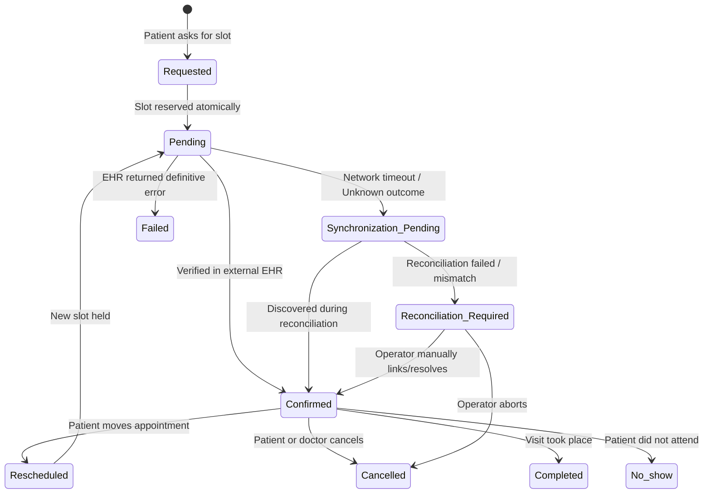

# Core Data Model & Entity Relationship Architecture

This document specifies the complete data model for the **AI.Prof Healthcare Platform**, implementing every entity from **PRD Section 22**, state categories from **PRD Section 23**, and the appointment state lifecycle from **PRD Section 14**.

---

## 1. Entity-Relationship Diagram (ERD)

```mermaid
erDiagram
    Platform ||--o{ Hospital : "governs"
    Hospital ||--o{ User : "employs / hosts"
    Hospital ||--o{ Department : "contains"
    Hospital ||--o{ Doctor : "credentials"
    Hospital ||--o{ Calendar : "schedules"
    Hospital ||--o{ WorkingHour : "scopes"
    Hospital ||--o{ BlockedSlot : "scopes"
    Hospital ||--o{ Slot : "generates"
    Hospital ||--o{ Appointment : "hosts"
    Hospital ||--o{ AppointmentStateHistory : "audits"
    Hospital ||--o{ Questionnaire : "publishes"
    Hospital ||--o{ QuestionnaireResponse : "receives"
    Hospital ||--o{ HealthcareSystemConnection : "integrates"
    Hospital ||--o{ ExternalIdentifierMapping : "maps"
    Hospital ||--o{ IntegrationOperation : "executes"
    Hospital ||--o{ IntegrationVerification : "verifies"
    Hospital ||--o{ ReconciliationRecord : "resolves"
    Hospital ||--o{ Workflow : "configures"
    Hospital ||--o{ WorkflowExecution : "runs"
    Hospital ||--o{ Notification : "dispatches"
    Hospital ||--o{ AiConversation : "channels"
    Hospital ||--o{ CapabilityExecution : "records"
    Hospital ||--o{ AiEvaluation : "measures"
    Hospital ||--o{ AuditEvent : "logs"
    Hospital ||--o{ OperationalEvent : "monitors"

    Department ||--o{ Doctor : "assigns"
    Specialty ||--o{ Doctor : "classifies"

    User ||--o| Doctor : "authenticates"
    User ||--o| Patient : "authenticates"
    User ||--o{ AuditEvent : "performs"

    Doctor ||--|| Calendar : "owns"
    Calendar ||--o{ WorkingHour : "defines"
    Calendar ||--o{ BlockedSlot : "restricts"
    Doctor ||--o{ Slot : "allocates"
    Doctor ||--o{ Appointment : "conducts"

    Patient ||--|| UserPreference : "configures"
    Patient ||--o{ Appointment : "attends"
    Patient ||--o{ QuestionnaireResponse : "submits"
    Patient ||--o{ AiConversation : "interacts"

    Slot ||--o{ Appointment : "reserves"
    Appointment ||--o{ AppointmentStateHistory : "tracks"
    Appointment ||--o{ IntegrationVerification : "verifies"
    Appointment ||--o{ ReconciliationRecord : "reconciles"
    Appointment ||--o{ WorkflowExecution : "triggers"
    Appointment ||--o{ QuestionnaireResponse : "links"

    Questionnaire ||--o{ QuestionnaireQuestion : "contains"
    Questionnaire ||--o{ QuestionnaireResponse : "records"

    AiConversation ||--|| AiContext : "maintains"
    AiConversation ||--o{ CapabilityExecution : "invokes"
    AiConversation ||--o{ AiEvaluation : "evaluates"

    HealthcareSystemConnection ||--o{ IntegrationOperation : "transacts"
    Workflow ||--o{ WorkflowExecution : "executes"
```



---

## 2. Multi-Tenant Isolation Architecture

To enforce zero data bleed between healthcare systems, tenant isolation is established at the **database layer** rather than solely in application business logic:

1. **Mandatory Foreign Key & Cascading:** Every tenant-scoped entity contains an explicit `hospitalId` foreign key referencing `Hospital(id)` with `onDelete: Cascade`.
2. **Database-Level Compound Constraints & Indexes:**
   - Single-column index: `@@index([hospitalId])` on all tenant-scoped tables to optimize multi-tenant query plans and prevent table scans.
   - Unique multi-tenant compound keys on `ExternalIdentifierMapping`:
     - `@@unique([hospitalId, entityType, internalId])`
     - `@@unique([hospitalId, entityType, externalId])`
     - `@@index([hospitalId, entityType])`
   - Calendar slot unique constraints: `@@unique([doctorId, startTime])` and `@@index([doctorId, startTime, isBooked])`.
3. **Tenant-Scoped Entities:**
   - `Hospital` (Tenant Root)
   - `User` (`hospitalId` nullable for platform admin; required for tenant staff)
   - `Department` (`hospitalId` NOT NULL, indexed)
   - `Doctor` (`hospitalId` NOT NULL, indexed)
   - `Calendar` (`hospitalId` NOT NULL, indexed)
   - `WorkingHour` (`hospitalId` indexed)
   - `BlockedSlot` (`hospitalId` indexed)
   - `Slot` (`hospitalId` NOT NULL, indexed)
   - `Appointment` (`hospitalId` NOT NULL, indexed)
   - `AppointmentStateHistory` (`hospitalId` NOT NULL, indexed)
   - `Questionnaire` (`hospitalId` NOT NULL, indexed)
   - `QuestionnaireResponse` (`hospitalId` indexed)
   - `HealthcareSystemConnection` (`hospitalId` NOT NULL, indexed)
   - `ExternalIdentifierMapping` (`hospitalId` NOT NULL, compound unique index)
   - `IntegrationOperation` (`hospitalId` NOT NULL, indexed)
   - `IntegrationVerification` (`hospitalId` NOT NULL, indexed)
   - `ReconciliationRecord` (`hospitalId` NOT NULL, indexed)
   - `Workflow` (`hospitalId` NOT NULL, indexed)
   - `WorkflowExecution` (`hospitalId` indexed)
   - `Notification` (`hospitalId` indexed)
   - `AiConversation` (`hospitalId` indexed)
   - `CapabilityExecution` (`hospitalId` indexed)
   - `AiEvaluation` (`hospitalId` indexed)
   - `AuditEvent` (`hospitalId` indexed, `tenantId` indexed)
   - `OperationalEvent` (`hospitalId` indexed, `tenantId` indexed)

---

## 3. Explicit Appointment State Lifecycle (PRD Section 14)

Appointments progress through strict, discrete states matching PRD Section 14. Every status change is immutably recorded in the `AppointmentStateHistory` table with actor context, timestamp, and correlation ID.



### Appointment Status Enum
- `Requested`: Preliminary patient booking intent.
- `Pending`: Local reservation created; internal slot locked; awaiting EHR confirmation.
- `Confirmed`: Successfully created and verified in external EHR.
- `Rescheduled`: Moved to a new slot; prior slot released.
- `Cancelled`: Cancelled by patient or doctor; slot released.
- `Completed`: Clinical visit finished.
- `No-show`: Patient failed to appear for scheduled appointment.
- `Failed`: Rejected by provider or external EHR.
- `Synchronization Pending`: Transient outcome during integration sync; proactive verification active.
- `Reconciliation Required`: Discrepancy or repeated timeout escalated to human operator.

### Prisma & TypeScript Status Enum Identifier Mapping

Because PRD Section 14 explicitly specifies status values with hyphens and spaces (`No-show`, `Synchronization Pending`, `Reconciliation Required`), programming languages (TypeScript) and database DDLs (Prisma / PostgreSQL) require distinct identifier handling to guarantee valid syntax while preserving the verbatim PRD string representation in database storage and API payloads.

| PRD Section 14 Value | TypeScript Enum Key (`@health/shared-types`) | String Literal Value (API & DB Storage) | Prisma Native Enum Identifier (PostgreSQL) |
| :--- | :--- | :--- | :--- |
| `Requested` | `AppointmentStatus.REQUESTED` | `"Requested"` | `Requested` |
| `Pending` | `AppointmentStatus.PENDING` | `"Pending"` | `Pending` |
| `Confirmed` | `AppointmentStatus.CONFIRMED` | `"Confirmed"` | `Confirmed` |
| `Rescheduled` | `AppointmentStatus.RESCHEDULED` | `"Rescheduled"` | `Rescheduled` |
| `Cancelled` | `AppointmentStatus.CANCELLED` | `"Cancelled"` | `Cancelled` |
| `Completed` | `AppointmentStatus.COMPLETED` | `"Completed"` | `Completed` |
| `No-show` | `AppointmentStatus.NO_SHOW` | `"No-show"` | `NO_SHOW @map("No-show")` |
| `Failed` | `AppointmentStatus.FAILED` | `"Failed"` | `Failed` |
| `Synchronization Pending` | `AppointmentStatus.SYNCHRONIZATION_PENDING` | `"Synchronization Pending"` | `SYNCHRONIZATION_PENDING @map("Synchronization Pending")` |
| `Reconciliation Required` | `AppointmentStatus.RECONCILIATION_REQUIRED` | `"Reconciliation Required"` | `RECONCILIATION_REQUIRED @map("Reconciliation Required")` |

#### Architectural Mapping Guarantees:
1. **TypeScript Codebase (`packages/shared-types`):**
   ```typescript
   export enum AppointmentStatus {
     REQUESTED = 'Requested',
     PENDING = 'Pending',
     CONFIRMED = 'Confirmed',
     RESCHEDULED = 'Rescheduled',
     CANCELLED = 'Cancelled',
     COMPLETED = 'Completed',
     NO_SHOW = 'No-show',
     FAILED = 'Failed',
     SYNCHRONIZATION_PENDING = 'Synchronization Pending',
     RECONCILIATION_REQUIRED = 'Reconciliation Required',
   }
   ```
2. **Prisma & Database Engine:**
   - **SQLite Development/CI Mode:** SQLite does not support native `CREATE TYPE ... AS ENUM`. The column is defined as `status String @default("Pending")`, storing the exact string literal values (`"No-show"`, `"Synchronization Pending"`, `"Reconciliation Required"`).
   - **PostgreSQL Production Mode:** When targeting PostgreSQL, Prisma native enums utilize the `@map("...")` attribute to bind valid DDL identifier names (`NO_SHOW`, `SYNCHRONIZATION_PENDING`, `RECONCILIATION_REQUIRED`) to their exact PRD string representations in the database catalog.
3. **No Lossy Serialization:** Wire payloads between the browser, API Server, Voice Gateway, and Mock EHR transmit the verbatim PRD strings, preventing mapping discrepancies across boundary services.

### `AppointmentStateHistory` Model
| Field | Type | Description |
| :--- | :--- | :--- |
| `id` | String (UUID) | Unique history entry identifier |
| `appointmentId` | String (UUID) | Reference to `Appointment` |
| `hospitalId` | String (UUID) | Tenant isolation key |
| `fromStatus` | String / Enum | Source appointment status |
| `toStatus` | String / Enum | Destination appointment status |
| `reason` | String? | Reason for state change |
| `actorId` | String? | User ID or System agent that triggered transition |
| `actorRole` | String? | Role (e.g. `PATIENT`, `DOCTOR`, `AI_AGENT`, `SYSTEM`) |
| `correlationId` | String? | Distributed trace correlation ID |
| `changedAt` | DateTime | Timestamp of transition |

---

## 4. Separation of State Categories (PRD Section 23)

To ensure high auditability, durability, and fault isolation, the data model avoids monolithic JSON blobs and maintains distinct, normalized schemas for all six state categories:

| State Category | Entities / Tables | Purpose & Guarantees |
| :--- | :--- | :--- |
| **Transactional State** | `Appointment`, `Slot`, `AppointmentStateHistory` | Strong ACID guarantees, optimistic locking, idempotent booking, race condition prevention. |
| **Conversational State** | `AiConversation`, `AiContext` | Real-time session state, active intent, temporary memory slots, and voice channel tracking. |
| **User Context / Preferences** | `UserPreference`, `Patient` | Patient communication preferences (SMS/email), preferred days/times, and accessibility preferences. |
| **Workflow State** | `Workflow`, `WorkflowExecution` | Durable background orchestration, delayed reminders, pre-visit questionnaire dispatch, and retries. |
| **Integration State** | `HealthcareSystemConnection`, `ExternalIdentifierMapping`, `IntegrationOperation`, `IntegrationVerification`, `ReconciliationRecord` | External system configurations, bi-directional ID translation, verification results, and discrepancy resolution. |
| **Operational State** | `OperationalEvent`, `AuditEvent`, `CapabilityExecution`, `AiEvaluation` | Structured audit trail, security violation tracking, latency metrics, and clinical safety compliance. |

---

## 5. External Identifier Mapping

The `ExternalIdentifierMapping` table provides bidirectional cross-referencing between internal platform identifiers and upstream healthcare system identifiers (e.g., FHIR resources, Epic/Cerner IDs, or Mock EHR IDs).

### Supported Entity Pairs
1. **Patient $\leftrightarrow$ ExternalPatient**: Maps `Patient.id` to EHR MRN / Patient Resource ID.
2. **Doctor $\leftrightarrow$ ExternalProvider**: Maps `Doctor.id` to EHR Practitioner / Provider NPI / Staff ID.
3. **Appointment $\leftrightarrow$ ExternalAppointment**: Maps `Appointment.id` to EHR Encounter / Appointment Resource ID.
4. **Facility $\leftrightarrow$ ExternalFacility**: Maps `Hospital.id` to EHR Location / Organization ID.

### Schema Definition
```prisma
model ExternalIdentifierMapping {
  id         String   @id @default(uuid())
  hospitalId String   // tenant isolation
  tenantId   String?  // backwards-compatibility alias
  entityType String   // PATIENT, DOCTOR, APPOINTMENT, FACILITY
  internalId String
  externalId String
  createdAt  DateTime @default(now())
  updatedAt  DateTime @updatedAt

  hospital Hospital @relation(fields: [hospitalId], references: [id], onDelete: Cascade)

  @@unique([hospitalId, entityType, internalId])
  @@unique([hospitalId, entityType, externalId])
  @@index([hospitalId, entityType])
}
```

---

## 6. Capability Catalog (PRD Section 10 & 22)

The system manages the exact 17 AI-callable capabilities in a dedicated metadata catalog model (`Capability`), alongside an immutable execution history table (`CapabilityExecution`):

| Capability Name | Category | Risk Level | Description |
| :--- | :--- | :--- | :--- |
| `search_hospitals` | DISCOVERY | `READ_ONLY` | Search directory of verified partner hospitals |
| `search_doctors` | DISCOVERY | `READ_ONLY` | Search credentialed physicians by specialty or criteria |
| `check_availability` | SCHEDULING | `READ_ONLY` | Query real-time calendar availability for doctor slots |
| `lookup_patient` | INTEGRATION | `LOW` | Find existing patient records by phone or identity |
| `get_appointment` | SCHEDULING | `READ_ONLY` | Retrieve appointment details and current status |
| `create_appointment` | SCHEDULING | `HIGH` | Book an appointment slot atomically |
| `reschedule_appointment` | SCHEDULING | `HIGH` | Reschedule an existing appointment to a new slot |
| `cancel_appointment` | SCHEDULING | `HIGH` | Cancel an appointment and release the calendar slot |
| `get_questionnaire` | WORKFLOW | `READ_ONLY` | Retrieve pre-visit intake questions for a specialty |
| `submit_questionnaire` | WORKFLOW | `LOW` | Submit patient responses for pre-visit clinical review |
| `send_notification` | COMMUNICATION | `LOW` | Dispatch patient notification via SMS, Email, or In-App |
| `start_workflow` | WORKFLOW | `LOW` | Initiate background workflow execution |
| `get_context` | COMMUNICATION | `READ_ONLY` | Retrieve active conversation memory snapshot |
| `update_preferences` | COMMUNICATION | `LOW` | Update patient communication and scheduling preferences |
| `verify_external_appointment` | INTEGRATION | `READ_ONLY` | Verify appointment state with external healthcare system |
| `synchronize_state` | INTEGRATION | `HIGH` | Synchronize appointment records with external EHR |
| `transfer_to_human` | COMMUNICATION | `HIGH` | Escalate call or conversation to human staff |
